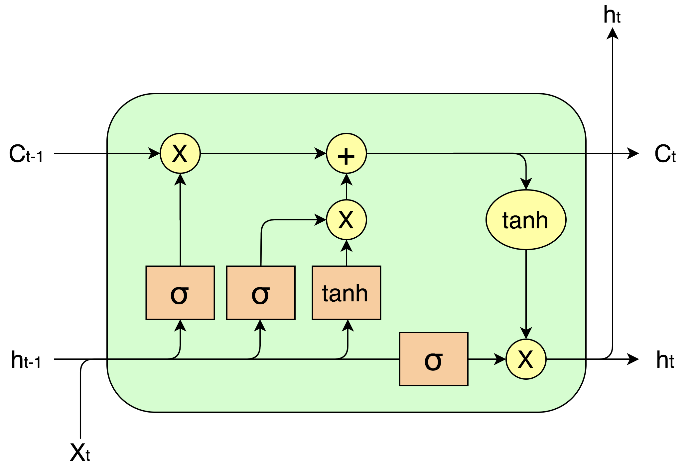

# LSTM Cell

This repository provides a basic implementation of an **LSTM cell** in PyTorch, designed to help understand the **key concepts** of LSTM functionality.

### Key Elements:
- **Forget Gate**: Controls how much of the previous cell state to keep.
- **Input Gate**: Decides how much of the new information to add.
- **Output Gate**: Determines how much of the updated cell state is revealed as the hidden state.

This code is for educational purposes to demonstrate the **core workings** of an LSTM cell.

